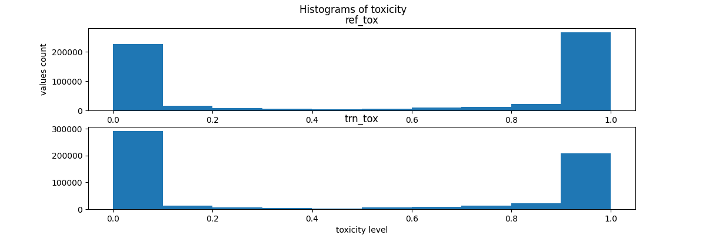

# Introduction
In this work I analysed the ParaNMT-detox corpus and applied it for training of an attention-armed GRU-Based Sequence 
Network for text detoxification task. Detoxification task aims to transform the reference toxic sentence to a neutral 
style translation with the same meaning as the reference.

Multiple approaches are possible for approaching the task. One approach is dictionary-based that transforms the toxic
words to neutral ones or even remove the words. Another approach that in contrast is capable of paraphrasing is 
sequence-based network. D. Dale *et. at* proposed the idea of style neutralization via subtraction of toxic embeddings 
before text generation process of a sequence-based network.

ParaNMT-detox dataset is a subset of the ParaNMT corpus, which contain 500k pairs of toxic and neutral sentences. Each 
sentence is labeled with toxicity level, that is toxic assessments over annotators number. 

In the course of work I used the CRISP-DM template for structuring my solution.

# Data analysis
I explored and preprocessed the ParaNMT-detox corpus. The aim of data exploration was to find insights about the data. 
I downloaded the dataset, explored its structure, checked specific samples, visualized data distribution, and checked
data quality attributes. This yielded knowledge about the following facts:
- A translation is the same as reference with a toxic words changed by synonyms with in most cases, while rarely
being paraphrased
- Some references are not toxic, while some translation are toxic. By toxicity I mean having corresponding value above 
0.5
- Existence of pairs with translation being more toxic than reference. Such cases are 0.45% of all dataset
- 90%+ of the sentences are either 0% or 100% toxic as shown in Fig. 1. This applies for both reference and translation
- Translation and reference lengths have the same distribution with a peak at 25 words as shown in Fig. 2. 90% of the 
- sequences are of lengths under 100
- Some of the words appear mostly in toxic sentences and vice versa
- Dataset is clean from null values
- Dataset has duplicated reference-translation pairs

Figure 1. Toxicity distribution for references and translations

Figure 2. Sentence lengths distribution for references and translations

With preprocessing implemented in `src/data/make_dataset.py` I adopted the
raw data for training and evaluation of the text detoxification algorithm implemented in 
`src/models/train_model.py`.

# Model Specification
Trying to improve capability of the model to identify relevant features, I decided to add attention mechanism in  
decoder after embedding layer of GRU-Based Sequence Network. The original model is a transformer, containing encoder and
decoder each consisting of the layers following each other: 128 hidden neurons embedding layer, ReLU, GRU and linear.
Maximum tokens to generate is 15. All the parameters might be changed in the `src/models/train_model.py` script.

The loss for the training is Negative log likelyhood. The metric for evaluation is BiLingual Evaluation Understudy 
(BLEU), that I discuss in details in section Evalutaion.

# Training Process
The training took 5 epochs, that is 30 minutes on machine with T4 GPU. Batch size was 32. Figures 3 and 4 illustrate 
the dynamics of loss and BLEU score with respect to training epochs.

Figure 3. BLEU metric with respect to training epochs for the sequence models

Figure 4. Negative log likelyhood loss with respect to training epochs for the sequence models

# Evaluation
In test design step I selected BLEU as a metric for performance evaluation of the 
models. The reason for choosing BLEU score is its appropriateness for the task, that is seq2seq translation and 
popularity in research community. The key idea behind BLEU is computing number of matching substrings between reference 
answers and candidates, thus this metric is tolerant for few words confusion or skipping. 

I used size of a validation set equal to 1% of preprocessed set, that gives almost the same evaluation results as 20%.

The model achieved 0.091 BLEU, that improve the score twice compared to original GRU-Based Sequence Network. From 
Figures 3 and 4 I observed that the score and loss with raise of epochs are still improving, so I concluded that the 
model has potential to improve multiple times in the score with increase of number of parameters and training time.

For the purpose of comparing the models, I note that the model that do not change the input sequence receive BLEU 
score = 0.23 on the validation set.

# Results
In this work I implemented and evaluated attention-armed sequence network that achieved 0.091 BLEU score after
5 epochs of training. I observed the potential of improvement of the model in score multiple times given the increase
of parameters number and training epochs number. In Table 1 in row "attn_trans_model" I show the detoxificated text by 
the considered model. One might observe that considered model better preserve the idea of the reference compared to 
the model without attention.

Table 1. References and corresponding translations and model results

| Sentence Source  |Detoxified sentence|
|------------------| ----- |
| Reference | You 're arrogant . You have the sickness that elites have had - throughout history in their literal , and in some cases figurative , ivory towers . |
| Translation | you are overwhelmed by the disease that elites have always been , - during history in your literal or metaphorical tower of ivory . |
| Model output | you re arrogant in the dictionary with the street and in the dictionary |
|------------------| ----- |
| Reference | Goddamn Variety had to print the story before I got the rights ! |
| Translation | the Goddam Variety printed the story before I got the rights . |
| Model output | oh my god that was the most before i got the rights ! |
|------------------| ----- |
| Reference | So he 's notgoing to kill you ? |
| Translation | so he wo n't kill you ? |
| Model output | so he s gon na kill you ? |
|------------------| ----- |
