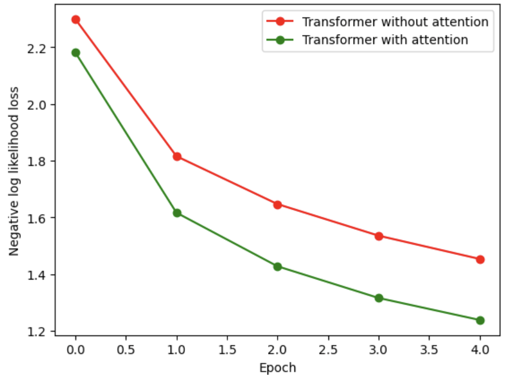

# Data Exploration
I explored and preprocessed the ParaNMT-detox corpus. The aim of data exploration was to find insights about the data. 
I downloaded the dataset, explored its structure, checked specific samples, visualized data distribution, and checked
data quality attributes. This yielded knowledge about the following facts:
- A translation is the same as reference with a toxic words changed by synonyms with in most cases, while rarely
being paraphrased
- Some references are not toxic, while some translation are toxic. By toxicity I mean having corresponding value above 
0.5
- Existence of pairs with translation being more toxic than reference. Such cases are 0.45% of all dataset
- 90%+ of the sentences are either 0% or 100% toxic as shown in Fig. 1. This applies for both reference and translation
- Translation and reference lengths have the same distribution with a peak at 25 words as shown in Fig. 2. 90% of the 
- sequences are of lengths under 100
- Some of the words appear mostly in toxic sentences and vice versa
- Dataset is clean from null values
- Dataset has duplicated reference-translation pairs

Figure 1. Toxicity distribution for references and translations

Figure 2. Sentence lengths distribution for references and translations

# Data Preprocessing
In data preprocessing stage I cleaned the data by getting rid of duplicates and removing the pairs where the 
translation was more toxic than reference. Although I could flip the pairs, this might make the data "unnatural", that 
may cause problems with training and evaluation.

# Test Design
In test design step I selected BiLingual Evaluation Understudy (BLEU) as a metric for performance evaluation of the 
models. The reason for choosing BLEU score is its appropriateness for the task, that is seq2seq translation and 
popularity in research community. The key idea behind BLEU is computing number of matching substrings between reference 
answers and candidates, thus this metric is tolerant for few words confusion or skipping. 

I used size of a validation set equal to 1% of preprocessed set, that gives almost the same evaluation results as 20%. 

For the purpose of comparing the models, I note that the model that do not change the input sequence receive BLEU 
score = 0.23 on the validation set.

# Baseline: Dictionary-Based Toxic Words Removal
I implemented the model based on removal of toxic words. A word is treated toxic if it appears in toxic comments more 
often than in neutral. I additionally filter words that appear in less than 100 (empirically derived value) toxic 
comments. Such a model yielded BLEU score 0.085 on validation set. An example of output of the model is illustrated in 
Table 1 at "rm_model" row.

Table 1. Outputs of proposed models for an input sentence "Goddamn Variety had to print the story before I got the 
rights !" whose translation is "the Goddam Variety printed the story before I got the rights ."

| Model name       |Detoxified sentence|
|------------------| ----- |
| rm_model         | "Variety to print the before I the rights" |
| wn_syn_model     | "damn Variety have to print the narration before I acquire the rights" |
| bert_syn_model   | " contacted Variety  permission to print the  article before I  acquired the rights ." |
| trans_model      | "the pope had to go to the ship before i went to the ship" |
| attn_trans_model | "oh my god that was the most before i got the rights !" |

# Hypothesis 1: Dictionary-Based Toxic Words Replacement by WordNet Synonyms
The next implemented model differse from previous by the way to deal with toxic words. This model replaces toxic words
with synonyms from WordNet. I chose the greedy algorithm to choose the synonym: I pick the most probable one from the
first category. The assumption under this approach is having neutral synonyms in the dictionary. This approach yielded 
0.095 BLEU score. The algorithm sample detoxification is illustrated in Table 1
in "wn_syn_model" row. 

# Hypothesis 2: Dictionary-Based Toxic Words Replacement by RoBERTa Synonyms
The following model works identically as previous, but the neutral synonims are generated with pretrained 
transformer-based model RoBERTa that, in contrast, take a context into account. I utilize masking modelling for forcing
the model to replace a toxic word. The resulted BLEU score is 0.09. Table 1 shows an example of the algorithm work
in "bert_syn_model" row.

# Hypothesis 3: Cover Paraphrasing with GRU-Based Sequence Network
Failing to beat the model that do not change the input with a Dictionary-based approaches, I decided to use more complex
method that is sequence network. The model is a transformer, containing encoder and decoder each consisting of 
the layers following each other: 128 hidden neurons embedding layer, ReLU, GRU and linear. The idea was to cover the 
samples in the dataset having paraphrase in translation. However, the train for 5 epochs yielded only 0.045 BLEU. 
Table 1 presents an example of detoxifiaction by the model in "trans_model" row.

# Hypothesis 4: Cover Paraphrasing with GRU-Based Sequence Network with Attention
Trying to improve capability of the model to identify relevant features, I decided to add attention mechanism to the 
decoder after embedding layer. The training took 5 epochs. The modification yielded improvement in BLEU in twice, that 
is 0.091 BLEU. From Figures 3 and 4 I observed that the score and loss with raise of epochs are still improving, so I 
concluded that this is the most well-performing model having potential to improve multiple times in the score with 
increase of number of parameters and training time. In Table 1 in row "attn_trans_model" I show the detoxificated text 
by the considered model. One might observe that considered model better preserve the idea of the reference compared to 
the model without attention.

Figure 3. BLEU metric with respect to training epochs for the sequence models

Figure 4. Negative log likelyhood loss with respect to training epochs for the sequence models

# Hypothesis 5: Use Big Pretrained Transformers and LLMs
Taking into account the trend on metrics improvement with increase of parameters of a transformer, use of pretrained 
big models and LLMs looks like a promising idea that might be checked in further research. 

# Results
To conclude, In this work I analysed the ParaNMT-detox corpus and applied it for training of various detoxification
models starting from simple dictionary-based methods ending with a recurrent and attention-based sequence network.
The evaluation shown that the attention-armed sequence network might receive the best BLEU score, that is 0.091 on
5 epochs of training. Nethertheless, Dictionary-Based Toxic Words Replacement by WordNet Synonyms is a strong baseline
that even outperform simple recurrent sequence network. Promising pretrained transformer and LLM-based approaches are 
also discussed.